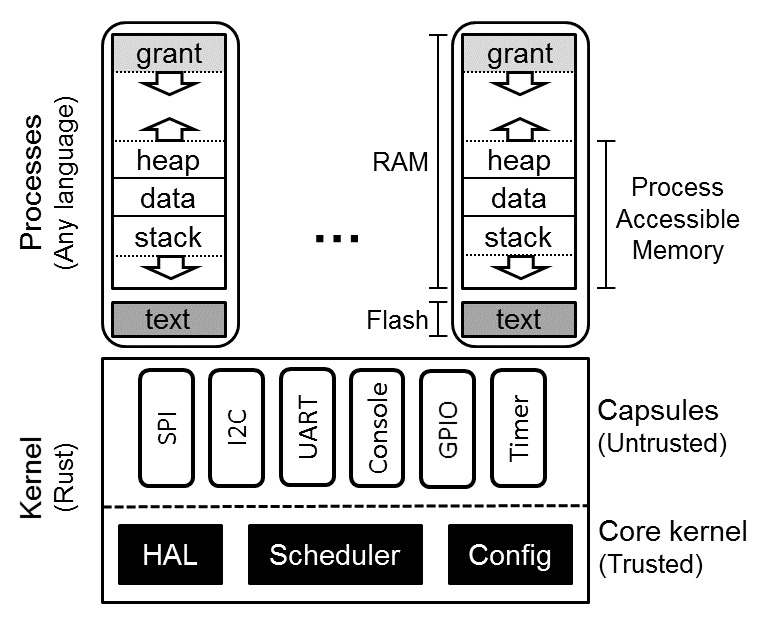

Hi everyone,

The Tock team is happy to announce a new feature to the Bluetooth Low Energy
Advertising driver which makes is possible for applications to advertise as if
they are different Bluetooth devices.
This is possible by taking advantage of process abstraction in Tock.
The driver is supported by both the nRF51-DK and nRF52-DK. However, because
nRFF51-DK only has 16kB of RAM, it can only run one process at a time in
practice.


## Feature description

Before getting into the actual implementation details we want show you how this
can be used in Tock. Let's assume you want to run Tock and send Bluetooth Low
Energy advertisements as four different devices with different configurations
such as device name, transmitting power, advertisement interval, services and
similar from the same physical device. This is now possible by running four
different applications in Tock. To demonstrate this, we run four
instances of the following application with different configurations:

```c
#include <simple_ble.h>
#include <string.h>
#include <tock.h>

int main(void) {
  uint16_t advertising_interval_ms = 300;
  uint8_t device_name[7] = "TockOS";

  // this is used to illustrate the different application configurations
  if (EXAMPLE_CONFIGURATION == 1) {
    device_name[6] = '1';
    advertising_interval_ms = 100;
  }

  else if (EXAMPLE_CONFIGURATION == 2) {
    device_name[6] = '2';
    advertising_interval_ms = 300;
  }

  else if (EXAMPLE_CONFIGURATION == 3) {
    device_name[6] = '3';
    advertising_interval_ms = 20;
  }

  else if (EXAMPLE_CONFIGURATION == 4) {
    device_name[6] = '4';
    advertising_interval_ms = 1000;
  }

  // configure advertisement interval
  // configure LE only and discoverable
  ble_initialize(advertising_interval_ms, true);

  // configure device name
  ble_advertise_name(device_name, sizeof(device_name) / sizeof(device_name[0]));

  // start advertising
  ble_start_advertising();

  return 0;
}
```

While running a Bluetooth Sniffer we find the four different Tock devices
with different configurations as the screenshot below shows:


Note, that the kernel manages to generate a unique static random device address
for each device, for interested readers more information about static device
address can be found in BLUETOOTH SPECIFICATION Version 4.2 [Vol 6, Part B],
section 1.3.2.1.
Also, applications by themselves configures different
advertisement intervals and device names that screenshot shows and the device
TockOS2 is actually configured as Thermometer service with dummy data.

## Implementation details

First of all, we have not blogged about how the Bluetooth Low Energy driver works.
The functionality is limited and supports only advertisements and passive scanning so
far i.e., no connections, different security modes and similar.


Overall, the driver works in the following sequence:
1. Initialize different Bluetooth parameters
(advertisement interval, device name, other gap data and etc.)
2. Start advertising or start scanning, (this implies to configure a virtual timer alarm)
3. The virtual alarm expires and the radio gets activated for short while (magnitude in terms of milliseconds), for example by sending advertisements
4. Reconfigure the virtual alarm and go to sleep
5. Steps 3 and 4 continue


However, in this blog post we want explain how we can use the Tock architecture
to achieve a high degree of concurrency in the Bluetooth Low Energy driver and
the different types of trade-offs that we have performed with the implementation.
A fundamental design decision in Tock is that the kernel is statically allocated
which implies that the kernel can't dynamically allocate memory. Instead Tock
uses a unique process model with five segments which the figure below shows:



In context of this driver, the grant segment is the essential part which makes
it possible for the kernel to allocate memory and store data for each process.
The grant contains Bluetooth Low Energy related data such as transmitting
power, advertising interval, the actual data to advertise, and state along with
a virtual timer alarm. Note, that the process itself has no access to the grant
segment.


First, let's discuss the virtual alarm because it essential
for correctness that the right process is identified when the timer fires.
Because the virtual alarm doesn't indicate which process triggered the actual alarm,
the driver must iterate through the grants to find the expired process.
Also, note that several alarms can expire at the same time by overlapping
advertisement intervals or that the radio is busy when an alarm expires.
In such scenarios, pseudo-randomness is introduced to break ties and re-schedule
a given process for later if the driver is busy. However, fairness and starvation
can't be guaranteed caused by non-determinism. On the other hand, starvation is
very unlikely for two reasons, first the number of processes is less than 10
and second the time that a process need utilize the radio is short compared to
the periodic interval. From the empirical tests it seems to work well with
fine-grained granularity down to advertisement interval of 20ms when running 4
processes concurrently.


Second, the Bluetooth Low Energy related data stored in the grant must be written
to the underlying chip before activating the chip because the order before an
expired alarm is not validated, i.e., the content in the radio buffer can contain
another application's buffer, the configuration has changed since the last activation
or the radio has been used in passive scanning mode.
This means, that the actual radio buffer and similar configuration must be
configured every time before starting scanning or advertising but not when
switching between different channels.


To conclude, each process has its own Bluetooth Low Energy state which indicates
whether it is idle, between advertising, between scanning, advertising or
scanning. Mutual exclusion is only ensured in advertising or scanning state
ensured by an atomic variable which makes re-configurations of the application
between advertising or scanning possible.

## Try it out

At the time of writing this the functionality is merged in the master branch
but not the applications used in the demonstration.
The applications can be found [here](https://github.com/niklasad1/tock/tree/nrf5x/radio_config/userland/examples/tests/ble/ble_nrf5x_concurrency)
