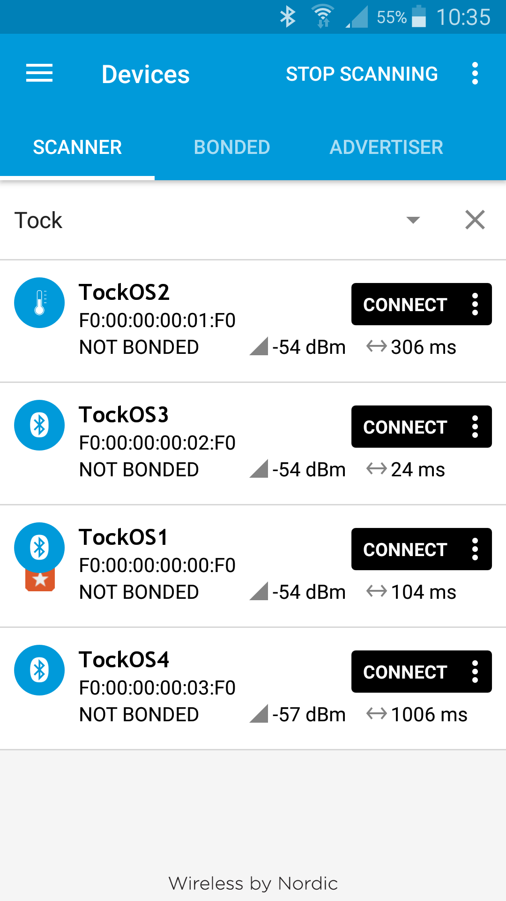

Hi everyone,
The Tock team is happy to announce a new feature to the Bluetooth Low Energy
Advertiser driver which makes is possible for applications to advertise as
they are different devices.
This is possible by taking advantage of Process Abstraction in Tock.
This driver is supported by nRF51-DK and nRF52-DK but because
nRF51-DK has only 16kB of RAM, there is only memory to run a process at the
time.

1. TOC
{:toc}

## Feature description
Before getting into the actual implementation details we want show you how this
can be used in Tock. Let's assume you want to run Tock and send Bluetooth Low
Energy advertisements as four different devices with different configuration
such as device name, transmitting power, advertisement interval, services and
similar by using only one chip. This is now possible by running four different
applications in Tock. To demostrate this for you we run four instances of the
following application with different configurations:


```c

#include <simple_ble.h>
#include <tock.h>

// Sizes in bytes
#define DEVICE_NAME_SIZE 7

int main(void) {
  // declarations of variables to be used in this BLE example application
  uint16_t advertising_interval_ms = 100;
  uint8_t device_name[] = "TockOS3";

  // configure advertisement interval to 300ms
  // configure LE only and discoverable
  ble_initialize(advertising_interval_ms, true);

  // configure device names as TockOS3
  ble_advertise_name(device_name, DEVICE_NAME_SIZE);

  // start advertising
  ble_start_advertising();

  return 0;
}

```

While running a Bluetooth Sniffer we find the four different Tock devices
with different configurations as the screenshot below shows:





Note, that the kernel manages to generate unique advertisement addresses known
as AdvA in the Bluetooth standard. Also, you can see that the applications by
themselves configures different advertisement intervals and device names.
TockOS2 is actually configured as Thermometer service with dummy data.


## Implementation details
First of all, we have not blogged about how the Bluetooth Low Energy driver works.
The functionality is limited and support only advertisements and passive scanning so
far i.e., no connections, different security modes and similar.


Overall, the driver works in the following sequence:
1. Initialize different Bluetooth parameters
(advertisement interval, device name, other gap data and etc)
2. Start advertise or start scanning, (this implies to configure virtual timer alarms)
3. The virtual alarm expires and the radio gets activated for short while (magnitude in terms of milliseconds), for example by sending advertisements
4. Reconfigure virtual alarm and go to sleep
5. Step 3 and 4 continues forever until an application explicitly stops the operation


However, in this blog post we want explain how we can use Tock architecture to
achieve high degree of concurrency in the Bluetooth Low Energy driver and
the different types of trade-offs we have performed with the implementation.
A fundamental design decision of Tock is that the kernel is statically allocated
which implies that the kernel can't dynamically allocate. Instead Tock uses an
unique process model with five segments which the figure below shows:


In context of this driver the grant segment is the essential part which makes
it possible for the kernel to allocate memory and store data for each process.
The grant contains Bluetooth Low Energy related data such as transmitting
power, advertising interval, the actual data to advertise, and state along with
virtual timer alarm.


First, let's discuss the virtual alarm because it essential
for correctness that the correct process is identified. Because, the virtual
alarm doesn't indicate which process that has triggered the actual alarm requires
iteration through the grants to find the expired process. Also, note that several
alarms can expire at the same time with overlapping advertisement intervals or
that the radio is busy once an alarm expires. In such scenarios, pseudo-randomness
is introduced to to break ties and re-schedule later.   


Second, the Bluetooth Low Energy related data stored in the grant must be written
underlying chip before activating the chip because the order is before the
expired alarm is not validated. This means, for example the actual radio buffer
and similar configuration must be configured every time before scanning or
advertising on channel 37 but not on channel 38 and 39 because these right after
each other with mutual exclusion.   


To conclude, each process has its own Bluetooth Low Energy state which indicates
whether it is idle, between advertisements, between scanning, advertising or
scanning. Mutual exclusion is only ensured in advertising or scanning state ensured by an atomic variable.  

## Try it out
At the time of writing this the functionality in the master branch but all
application used in the feature description can be found here [here](https://github.com/niklasad1/tock/tree/nrf5x/radio_config/userland/examples/tests/ble/ble_nrf5x_concurrency)
